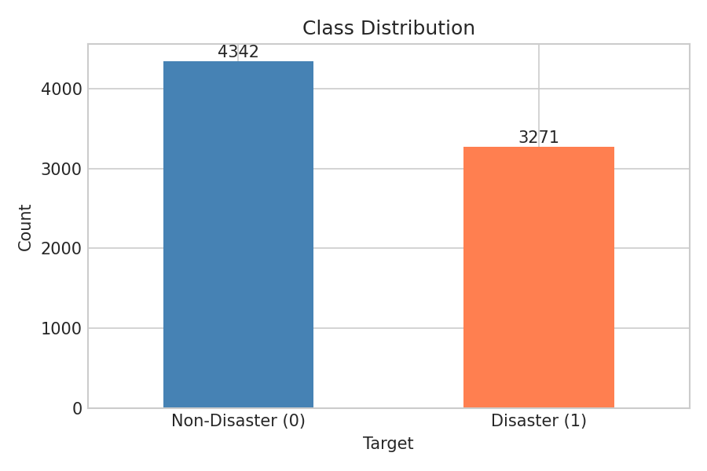
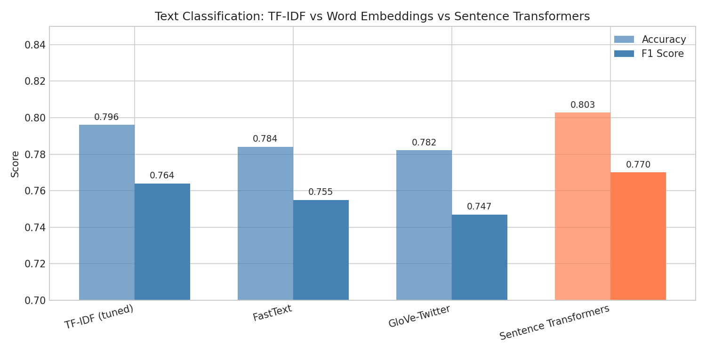
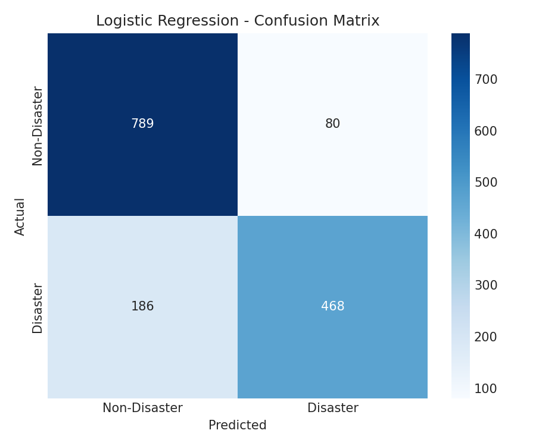

# Disaster Tweet Classification

**Sprint 3 Project** - MasterSchool NLP & LLMs Course

## The Problem

**Task:** Classify tweets as disaster-related (1) or non-disaster (0)

**Challenge:** The same words can have different meanings:
- "The building is on fire" → Disaster
- "That mixtape is fire" → Not a disaster

The model must learn **context**, not just keywords.

## Why This Approach

The goal of this project goes beyond achieving a high F1 score. The intention is to **understand LLMs from the ground up** by progressively exploring how text representation evolved:

1. **TF-IDF** - How machines first learned to "read" (word counts)
2. **Word Embeddings** - How words gained meaning (semantic vectors)
3. **Sentence Transformers** - How context changed everything (the transformer architecture behind GPT/BERT)

By building each approach and comparing results empirically, we develop intuition for *why* transformers revolutionized NLP - not just *that* they did.

**Dataset:** 7,613 labeled tweets from [Kaggle NLP Getting Started](https://www.kaggle.com/c/nlp-getting-started)



## Results

| Method | F1 Score | Context-Aware |
|--------|----------|---------------|
| **Sentence Transformers** | **0.770** | Yes |
| TF-IDF (tuned) | 0.764 | No |
| FastText | 0.755 | No |
| GloVe-Twitter | 0.747 | No |



## The NLP Evolution (Explored in This Project)

```
TF-IDF (1972)
    ↓ "Words are independent counts"
Word2Vec/GloVe (2013-2014)
    ↓ "Words are dense vectors with semantic meaning"
FastText (2016)
    ↓ "Subwords handle unknown words (like BPE in LLMs)"
Transformers/BERT (2018+)
    ↓ "Context determines meaning"
```

## Key Findings

1. **Empirical > Theoretical** - Tested 5 models; Logistic Regression beat SVM, Random Forest, XGBoost
2. **TF-IDF beat word embeddings** - GloVe (2B tweets) and FastText lost to simple TF-IDF
3. **Averaging destroys information** - Converting word vectors to document vectors loses importance
4. **Context is the breakthrough** - Sentence Transformers understand "fire" differently based on context

## Model Performance



**Error patterns:**
- False negatives: Metaphorical language ("drowning in work")
- False positives: Disaster words in casual context ("slicker than an oil spill")

## Project Structure

```
├── notebooks/
│   └── s03_disaster_tweets.ipynb   # Main notebook (Colab-compatible)
├── data/
│   └── train.csv                   # Dataset
├── outputs/figures/                # Visualizations
└── docs/
    ├── plan/                       # Project plan
    ├── checkpoints/                # Daily progress
    ├── blog-post-draft.md          # Full technical article
    ├── blog-materials.md           # Blog preparation materials
    ├── dsm-feedback-backlogs.md    # DSM process feedback
    ├── dsm-feedback-methodology.md # Project methodology for DSM
    └── dsm-feedback-blog.md        # Blog creation process feedback
```

## Notebook Sections

1. **Setup & EDA** - Class distribution, text characteristics
2. **Preprocessing** - URL removal, lemmatization, stopwords
3. **Vectorization** - TF-IDF with bigrams
4. **Baseline Modeling** - Logistic Regression, Naive Bayes
5. **Model Optimization** - GridSearchCV, cross-validation, ensembles
6. **Word Embeddings** - GloVe-Twitter, FastText comparison
7. **Sentence Transformers** - Contextual embeddings (SBERT)
8. **Conclusions** - Key learnings and limitations

## Run the Notebook

**Google Colab (recommended):**
1. Open `notebooks/s03_disaster_tweets.ipynb` in Colab
2. Select **T4 GPU** runtime (Runtime → Change runtime type) for faster Sentence Transformers
3. The notebook prompts for a Kaggle API token (`KGAT_` format):
   - Generate token at [Kaggle Settings → API → Create New Token](https://www.kaggle.com/settings)
   - [Accept competition rules](https://www.kaggle.com/c/nlp-getting-started/rules) (required for download)
4. Dependencies install automatically

**Local:**
```bash
pip install pandas numpy scikit-learn matplotlib seaborn nltk gensim sentence-transformers xgboost
jupyter notebook notebooks/s03_disaster_tweets.ipynb
```

**Data:** Auto-downloads from Kaggle if `data/train.csv` not present.

## Author

**Alberto Diaz Durana** - January 2026
